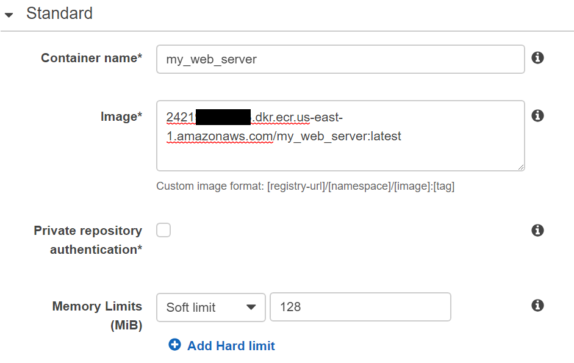
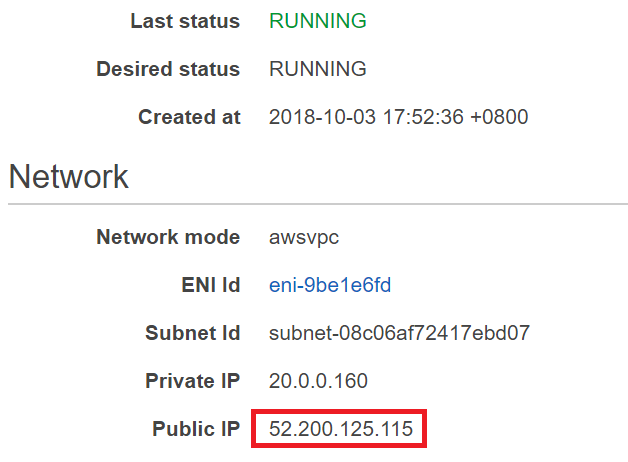
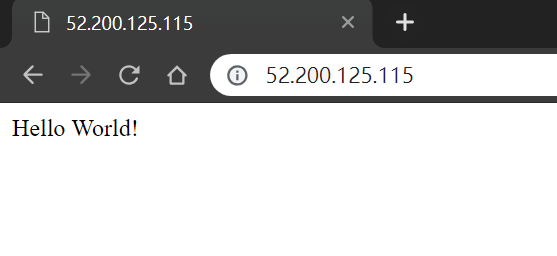
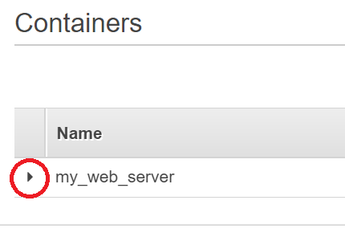
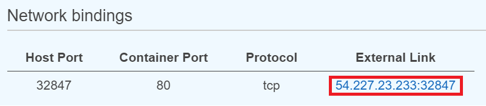
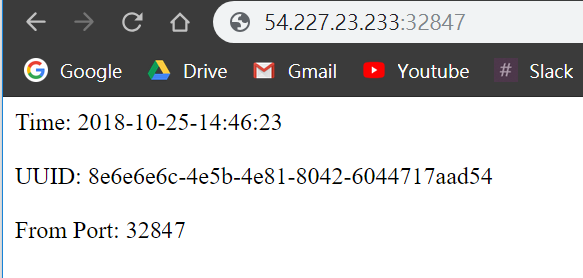

# Get Started with Amazon ECS Service
In this tutorial, we will create a container which serves as a web server by using Amazon Elastic Container Service ([Amazon ECS](https://aws.amazon.com/ecs)). Before starting, make sure there exists executable image stored in Amazon Elastic Container Registry ([Amazon ECR](https://aws.amazon.com/ecr)). 

## Prerequisites
* Make sure the region is **US East (N. Virginia)**, which its short name is **us-east-1**.

* Make sure there exists **executable image** stored in Amazon ECR. For more details, please refer to [Get Started with Docker & Amazon ECR](../README.md).

## Determine Using Amazon Fargates or EC2 instance
In Amazon ECS, we can easily launch containers without management of instances by using Amazon Fargate. We can also launch containers on Amazon EC2 instances and manage instances ourself.

The following content is divided into two parts. For using Amazon Fargate, please step to **Use Amazon Fargate** part. For using Amazon EC2, please step to **Use Amazon EC2 Instance** part.

## Use Amazon Fargate

### Create Cluster
* In the **AWS Management Console**, on the **service** menu, click **Elastic Container Service**.

* On the left panel, click **Clusters**.

* Click **Create Cluster**.

* Click **Networking only** and Click **Next step**.

* In **Cluster Name**, Type **FargateCluster**.

* In **Networking** part, it's optional to create a new VPC for the cluster. In this tutorial, we create a new VPC here hence we **click the checkbox of create VPC**.

* In **CIDR Block**, type **10.1.0.0/16**.

* In **Subnet 1**, type **10.1.0.0/24**.

* In **Subnet 2**, type **10.1.1.0/24**.

* Click **create** and wait for the creation.

### Create Task Definition for Amazon ECS

* Back to [Amazon ECS console](https://console.aws.amazon.com/ecs/home), click **Task Definitions** on left panel.

* Click **Create new Task Definition**.

* Select **Fargate** type and click **Next Step**.

* In **Task Definition Name**, type **runWebServerWithFargate**.

* In **Network Mode**, select **awsvpc**.

* Step to Task execution IAM role part, in **Task execution role**, select **Create new role**.

* Step to Task Size part, in **Task Memory (GB)**, select **0.5GB**.

* In **Task CPU (vCPU)**, select **0.25 vCPU**.

* In **Container Definetions** part,  click **Add container** button to add a container. In Amazon ECS, we can define several containers for a task. In this tutorial, we only define one container which will serve as a web server. 

* In **Container name**, type **my_web_server**.

* In **Image**, type **`[Repository URI]:latest`**.

      2421xxxxxxxx.dkr.ecr.us-east-1.amazonaws.com/my_web_server:latest

* In **Memory Limits (MB)**, Select **Soft limit** and type **128**.

  

* In **Port mappings**, type **80** and select **tcp**.

* Click **Add**.

* Click **Create** and wait for the creation of Task Definition.

### Create Service on Amazon ECS
After creating task definition, we can start a task standalone or start several tasks simultaneously by creating a service. In this tutorial, we will create a service.

* Back to [Amazon ECS console](https://console.aws.amazon.com/ecs/home), click **Clusters** on left panel.

* Click **FargateCluster**.

* In **Services** tab, click **Create**.

* In **Launch type**, select **FARGATE**.

* In **Task Definition**, select **runWebServerUsingFargate**.

* In **Service name**, type **myWebServerUsingFargate**.

* In **Number of tasks**, type **1**. If you want to create a service which starts several tasks simultaneously, you can type the number of tasks you need here. In this tutorial, we only need a task hence we type 1 here.

* Click **Next step**.

* In **Cluster VPC**, select **the VPC with CIDR 10.1.0.0/16**.

* In **Subnet**, add **both subnet**.

* In **Auto-assign public IP**, select **ENABLE**.

* Leave the rest of setting as default and click **Next step**.

* Click **Next step**.

* Click **Create Service** and wait for creation.

* Click **View Service**.

* In Service page, click **Tasks** tab below and we can see there is a tasks.

* Click **the task** in task list, refresh the page until the **Last status** is **RUNNING** rather than **PENDING**.

* Copy the **public IP**.

  

* Open a new browser tab, paste the IP address and press Enter. In the browser, we should be able to see the container's UUID and using port.

  
	
### Conclusion

You have learned how to create task definition and launch container on Amazon ECS.

### Clean Resources

To avoid excessive billing, please delete the following resources when you have finished your practice.

* Service or Task of ECS cluster
* EC2 instances (If using EC2 instance as cluster nodes)
* The VPC you created
* The cluster you created (Delete the VPC first before deleting cluster.)

## Use Amazon EC2 Instance

### Create Cluster
* In the **AWS Management Console**, on the **service** menu, click **Elastic Container Service**.

* On the left panel, click **Clusters**.

* Click **Create Cluster**.

* Click **EC2 Linux + Networking** and click **Next step**.

* In **Cluster Name**, type **EC2Cluster**.

* In Instance Configuration part, in **EC2 instance type**, select **t2.micro**.

* In **Number of instances**, type **1**.

* In Networking part, select **Create a new VPC**.

* In **CIDR Block**, type **10.2.0.0/16**.

* In **Subnet 1**, type **10.2.0.0/24**.

* In **Subnet 2**, type **10.2.1.0/24**.

* Leave other settings as default, click **create** and wait for the creation.

### Create a Task Definition for Amazon ECS

* Back to [Amazon ECS console](https://console.aws.amazon.com/ecs/home), click **Task Definitions** on left panel.

* Click **Create new Task Definition**.

* Select **EC2** type and click **Next Step**.

* In **Task Definition Name**, type **runWebServerWithEC2**.

* In **Network Mode**, select **\<default\>**.

* Step to Task Size part, In **Task Memory (MiB)**, type **256**.

* In **Task CPU (unit)**, type **0.25 vCPU**.

* In **Container Definetions** part,  click **Add container** button to add a container. In Amazon ECS, we can define several containers for a task. In this tutorial, we only define one container which will serve as a web server. 

* In **Container name**, type **my_web_server**.

* In **Image**, type **`[Repository URI]:latest`**.

      2421xxxxxxxx.dkr.ecr.us-east-1.amazonaws.com/my_web_server:latest

* In **Memory Limits (MB)**, Select **Soft limit** and type **128**.

  

* In **Port mappings**, type **0** for Host port(or leave it as blank), type **80** for Container port and select **tcp**.

* Click **Add**.

* Click **Create** and wait for the creation of Task Definition.

### Create Service on Amazon ECS
After creating task definition, we can start a task standalone or start several tasks simultaneously by creating a service. In this tutorial, we will create a service. 

* Back to [Amazon ECS console](https://console.aws.amazon.com/ecs/home), click **Clusters** on left panel.

* Click **EC2Cluster**.

* In **Services** tab, click **Create**.

* In **Launch type**, select **EC2**.

* In **Task Definition**, select **runWebServerWithEC2**.

* In **Service name**, type **myWebServerUsingEC2**.

* In **Service type**, select **REPLICA**.

* In **Number of tasks**, type **1**. If you want to create a service which starts several tasks simultaneously, you can type the number of tasks you need here. In this tutorial, we only need a task hence we type 1 here.

* Click **Next step**.

* Click **Next step**.

* Click **Next step**.

* Click **Create Service** and wait for the creation.

* Click **View Service**.

* In Service page, click **Tasks** tab below and we can see there is a tasks.

* Click **the task** in task list, refresh the page until the **Last status** is **RUNNING** rather than **PENDING**.

* In **Containers** part, click **the triangle arrow** below to expand the table.

  

* Copy the **External Link** in **Network bindings** part.

  

* Open a new browser tab, paste the external link and press Enter. In the browser, we should be able to see the container's UUID and using port.

  

### Conclusion

You have learned how to create task definition and launch container on Amazon ECS.

### Clean Resources

To avoid excessive billing, please delete the following resources when you have finished your practice.

* Service or Task of ECS cluster
* EC2 instances (If using EC2 instance as cluster nodes)
* The VPC you created
* The cluster you created (Delete the VPC first before deleting cluster.)