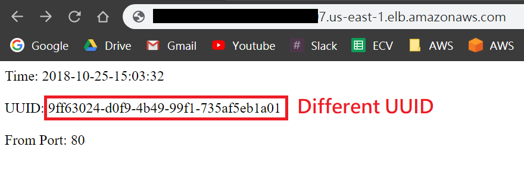

# Auto Scaling on Amazon ECS

After learning how to create a service on Amazon ECS, we will learn how to auto scale service on Amazon ECS and use Amazon Elastic Load Balancer to forward requests.

## Prerequisites
* Make sure the region is **US East (N. Virginia)**, which its short name is **us-east-1**.

* The following examples are based on our previous tutorial, make sure **you have created resources** on Amazon ECS by following [Get Started with Amazon ECS Service](../202-Get-Started-with-Amazon-ECS-Service/README.md).

## Auto Scale Service on Amazon ECS
In this section, we will set up a service which can adjust the number of tasks itself to meet the demand. 

> Note: The following steps take Fargate launch type for example and also apply to EC2 container launch type. For EC2 container launch type, we highlight the steps with parentheses. For example, `Click FargateCluster (EC2Cluster)` means you need to click `EC2Cluster` rather than FargateCluster if you are setting up with EC2 container launch type.

* In [ECS console](https://console.aws.amazon.com/ecs/home?region=us-east-1#/clusters), click **Clusters** on left panel. 

* Click **FargateCluster (EC2Cluster)**.

* In tab **Services**, click **Create** button.

* In **Launch type**, click **FARGATE (EC2)**.

* In **Task Definition**, select **runWebServerWithFargate (runWebServerWithEC2)**.

* In **Service name**, type **AutoScalingFargateService (AutoScalingEC2Service)**.

* In **Number of tasks**, type **1**.

* Click **Next step** button.

* In Cluster VPC, select **the VPC with CIDR 10.1.0.0/16 (10.2.0.0/16)** which you created in [Get Started with Amazon ECS Service](../202-Get-Started-with-Amazon-ECS-Service/README.md).

* In **Subnet**, add **both subnet**.

* Step to Load balancing part, select **Application Load Balancer**.

* Click [**EC2 Console**](https://us-east-1.console.aws.amazon.com/ec2/v2/home?region=us-east-1#SelectCreateELBWizard:) to create an Application Load Balancer.

* In Application Load Balancer, click the **Create** button below.

* In **Name**, type **ECSFargateLoadBalancer (ECSEC2LoadBalancer)**.

* Step to Availability Zones part, For VPC, select **the VPC with CIDR 10.1.0.0/16 (10.2.0.0/16)**.

* Select **both subnet**.

* Click **Next: Configure Security Settings** button.

* Click **Next: Configure Security Groups** button.

* In Step3: Configure Security Groups, select **Create a new security group**.

* In **Security group name**, type **AllowTCPForLoadBalancer**.

* In **Type**, select **All TCP**.

* In **Source**, select **Anywhere**.

* Click **Next: Configure Routing**.

* In **Target group**, select **New target group**.

* In **Name**, Type **FargateContainers (EC2Containers)**.

* In **Protocol**, select **HTTP**.

* In **Target type**, select **ip**.

* In **Path**, type **/**.

* Click **Next: Register Targets**.

* Because we can set up the service which can automatically register containers itself, therefore we click **Next: Review** to skip.

* Click **Create** and wait for the creation.

* Back to **Create Service** page.

* Click **Refresh** button, and select **ECSFargateLoadBalancer (ECSEC2LoadBalancer)**.

* Click **Add to load balancer** button.

* In **Listener Port**, select **80:HTTP (create new with 81 port)**.

* In **Target group name**, select **FargateContainers (create new)** which we created before.

>Note: if your are setting an EC2 launch type service with **bridge** networking mode, you have to select **create new** here.

* In **Evaluation order**, type **a number between 0~1000**.

* Click **Next step** button.

* In **Service Auto Scaling**, select **Configure Service Auto Scaling to adjust your service's desired count**.

* In **Minimum number of tasks**, type **1**.

* In **Maximum number of tasks**, type **2**.

* For **Automatic task scaling policies** part, in **Scaling policy type**, select **Target tracking**.

* In **Policy name**, type **myScalingPolicy**.

* In **ECS service metric**, select **ALBRequestCountPerTarget**.

* In **Target value**, type **3**.

* Click **Next step**.

* Click **Create Service** and wait for creation.

* Click **View Service**.

* Go to [**CloudWatch Management Console**](https://console.aws.amazon.com/cloudwatch/home?region=us-east-1#dashboard:).

* Click **Alarms** on left penal.

* In search bar, type **AutoScalingFargateService (AutoScalingEC2Service)** to search alarm.

* Select the alarm with **`AlarmHigh`** suffix.

* Click **Actions -> Modify**.

* In **for** attribute, modify it as **1 out of 1 datapoints**.

* Click **Save Changes**.

* Select the alarm with **`AlarmLow`** suffix.

* Click **Actions -> Modify**.

* In **for** attribute, modify it as **1 out of 1 datapoints**.

* Click **Save Changes**.

* Go to [**EC2 console**](https://console.aws.amazon.com/ec2/v2/home?region=us-east-1), click **Load Balancers** on left panel.

* Click **ECSFargateLoadBalancer (ECSEC2LoadBalancer)** which we created before, in **Description** tab, copy the **DNS name**.

* Open a new tab in your browser, paste **the DNS name** (if you are launching EC2 container type, add **`:81`** at the end of DNS name) and **press Enter**. You should be able to see the container's UUID and using port.

* **Refresh** the page **at least 4 times**, and wait for a while. (This might take 3~10 minutes.)

* Back to **ECS console -> Clusters -> FargateCluster (EC2Cluster) -> AutoScalingFargateService (AutoScalingEC2Service)**.

* Keep refreshing the page and you should be able to see that there are two tasks running now (or one is provisioning and one is running).

* Meanwhile, back to the page which displays container's UUID and refresh the page. You should be able to see a new container UUID since the second container has been launched. 

<!-- 

## Auto Scale Fargate Service on Amazon ECS
While using Fargate, we can scale the service to fit our requrement without taking care of instances. In this section, we will create a service which can adjust the number of tasks automatically. The task we defined includes a container serving as a web server.

* In [ECS console](https://console.aws.amazon.com/ecs/home?region=us-east-1#/clusters), click **Clusters** on left panel. 

* Click **FargateCluster**.

* In tab **Services**, click **Create** button.

* In **Launch type**, click **FARGATE**.

* In **Task Definition**, select **runWebServerWithFargate**.

* In **Service name**, type **AutoScalingFargateService**.

* In **Number of tasks**, type **1**.

* Click **Next step** button.

* In Cluster VPC, select **the VPC with CIDR 10.1.0.0/16** which you created in [Get Started with Amazon ECS Service](../202-Get-Started-with-Amazon-ECS-Service/README.md).

* In **Subnet**, add **both subnet**.

* Step to Load balancing part, select **Application Load Balancer**.

* Click [**EC2 Console**](https://us-east-1.console.aws.amazon.com/ec2/v2/home?region=us-east-1#SelectCreateELBWizard:) to create an Application Load Balancer.

* In Application Load Balancer, click the **Create** button below.

* In **Name**, type **ECSFargateLoadBalancer**.

* Step to Availability Zones part, For VPC, select **the VPC with CIDR 10.1.0.0/16**.

* Select **both subnet**.

* Click **Next: Configure Security Settings** button.

* Click **Next: Configure Security Groups** button.

* In Step3: Configure Security Groups, select **Create a new security group**.

* In **Security group name**, type **AllowHTTPForLoadBalancer**.

* In **Type**, select **HTTP**.

* In **Source**, select **Anywhere**.

* Click **Next: Configure Routing**.

* In **Target group**, select **New target group**.

* In **Name**, Type **FargateContainers**.

* In **Protocol**, select **HTTP**.

* In **Target type**, select **ip**.

* In **Path**, type **/**.

* Click **Next: Register Targets**.

* Because we can set up the service to automatically register containers, therefore we click **Next: Review** to skip.

* Click **Create** and wait for the creation.

* Back to **Create Service** page.

* Click **Refresh** button, and select **ECSFargateLoadBalancer**.

* Click **Add to load balancer** button.

* In **Listener Port**, select **80:HTTP**.

* In **Target group name**, select **FargateContainers** which we created before.

* Click **Next step** button.

* In **Service Auto Scaling**, select **Configure Service Auto Scaling to adjest your service's desired count**.

* In **Minimum number of tasks**, type **1**.

* In **Maximum number of tasks**, type **2**.

* In **IAM role for Service Auto Scaling**, select **Create new role**.

* For **Automatic task scaling policies** part, in **Scaling policy type**, select **Target tracking**.

* In **Policy name**, type **myScalingPolicy**.

* In **ECS service metric**, select **ALBRequestCountPerTarget**.

* In **Target value**, type **3**.

* Click **Next step**.

* Click **Create Service** and wait for creation.

* Click **View Service**.

* Go to [**CloudWatch Management Console**](https://console.aws.amazon.com/cloudwatch/home?region=us-east-1#dashboard:).

* Click **Alarms** on left penal.

* In search bar, type **AutoScalingFargateService** to search alarm.

* Select the alarm with **`AlarmHigh`** suffix.

* Click **Actions -> Modify**.

* In **for** attribute, modify it as **1 out of 1 datapoints**.

* Click **Save Changes**.

* Select the alarm with **`AlarmLow`** suffix.

* Click **Actions -> Modify**.

* In **for** attribute, modify it as **1 out of 1 datapoints**.

* Click **Save Changes**.

* Go to [**EC2 console**](https://console.aws.amazon.com/ec2/v2/home?region=us-east-1), click **Load Balancers** on left panel.

* Click **ECSFargateLoadBalancer** which we created before, in **Description** tab, copy the **DNS name**.

* Open a new tab in your browser, paste **the DNS name** and press Enter. You should be able to see the **hello world** message.

 

* **Refresh** the page **at least 4 times**, and wait for a minute.

* Back to **ECS console -> Clusters -> FargateCluster -> AutoScalingFargateService**.

* Keep refreshing the page and you should be able to see that there are two tasks running now (or one is provisioning and one is running).

-->

<!--
## Auto Scale EC2 Service on Amazon ECS

* In Amazon ECS console, click **Clusters** on left panel. 

* Click **EC2Cluster**.

* In tab **Services**, click **Create** button.

* In **Launch type**, click **EC2**.

* In **Task Definition**, select **runWebServerWithEC2**.

* In **Service name**, type **AutoScalingEC2Service**.

* In **Number of tasks**, type **1**.

* Click **Next step** button.

* In Cluster VPC, select **the VPC with CIDR 10.2.0.0/16** which you created in [Get Started with Amazon ECS Service](../202-Get-Started-with-Amazon-ECS-Service/README.md).

* In **Subnet**, add **both subnet**.

* Step to Load balancing part, select **Application Load Balancer**.

* Click [**EC2 Console**](https://us-east-1.console.aws.amazon.com/ec2/v2/home?region=us-east-1#SelectCreateELBWizard:) to create an Application Load Balancer.

* In Application Load Balancer, click the **Create** button below.

* In **Name**, type **ECSEC2LoadBalancer**.

* Step to Availability Zones part, For VPC, select **the VPC with CIDR 10.2.0.0/16**.

* Select **both subnet**.

* Click **Next: Configure Security Settings** button.

* Click **Next: Configure Security Groups** button.

* In Step3: Configure Security Groups, select **Create a new security group**.

* In **Security group name**, type **AllowHTTPForLoadBalancer**.

* In **Type**, select **HTTP**.

* In **Source**, select **Anywhere**.

* Click **Next: Configure Routing**.

* In **Target group**, select **New target group**.

* In **Name**, Type **EC2Containers**.

* In **Protocol**, select **HTTP**.

* In **Target type**, select **ip**.

* In **Path**, type **/**.

* Click **Next: Register Targets**.

* Because we can set up the service to automatically register containers, therefore we click **Next: Review** to skip.

* Click **Create** and wait for the creation.

* Back to **Create Service** page.

* Click **Refresh** button, and select **ECSEC2LoadBalancer**.

* Click **Add to load balancer** button.

* In **Listener Port**, select **80:HTTP**.

* In **Target group name**, select **EC2Containers** which we created before.

* Click **Next step** button.

* In **Service Auto Scaling**, select **Configure Service Auto Scaling to adjest your service's desired count**.

* In **Minimum number of tasks**, type **1**.

* In **Maximum number of tasks**, type **2**.

* In **IAM role for Service Auto Scaling**, select **Create new role**.

* For **Automatic task scaling policies** part, in **Scaling policy type**, select **Target tracking**.

* In **Policy name**, type **myScalingPolicy**.

* In **ECS service metric**, select **ALBRequestCountPerTarget**.

* In **Target value**, type **3**.

* Click **Next step**.

* Click **Create Service** and wait for creation.

* Click **View Service**.

* Go to [**CloudWatch Management Console**](https://console.aws.amazon.com/cloudwatch/home?region=us-east-1#dashboard:).

* Click **Alarms** on left penal.

* In search bar, type **AutoScalingEC2Service** to search alarm.

* Select the alarm with **`AlarmHigh`** suffix.

* Click **Actions -> Modify**.

* In **for** attribute, modify it as **1 out of 1 datapoints**.

* Click **Save Changes**.

* Select the alarm with **`AlarmLow`** suffix.

* Click **Actions -> Modify**.

* In **for** attribute, modify it as **1 out of 1 datapoints**.

* Click **Save Changes**.

* Go to [**EC2 console**](https://console.aws.amazon.com/ec2/v2/home?region=us-east-1), click **Load Balancers** on left panel.

* Click **ECSEC2LoadBalancer** which we created before, in **Description** tab, copy the **DNS name**.

* Open a new tab in your browser, paste **the DNS name** and press Enter. You should be able to see the **hello world** message.

 

* **Refresh** the page **at least 4 times**, and wait for a minute.

* Back to **ECS console -> Clusters -> EC2Cluster -> AutoScalingEC2Service**.

* Keep refreshing the page and you should be able to see that there are two tasks running now (or one is provisioning and one is running).

-->

