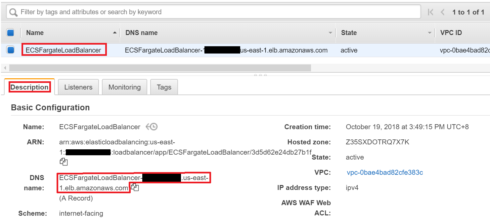

# Auto Scaling on Amazon ECS

After learning how to create a service on Amazon ECS, we will learn how to auto scale service and instance on Amazon ECS and use Amazon Elastic Load Balancer to forward requests.

## Prerequisites
* Make sure the region is **US East (N. Virginia)**, which its short name is **us-east-1**.

* The following examples are based on our previous tutorial, make sure **you have created resources** on Amazon ECS by following [Get Started with Amazon ECS Service](../202-Get-Started-with-Amazon-ECS-Service/README.md).

## Auto Scale Service on Amazon ECS
In this section, we will set up a service which can adjust the number of tasks itself to meet the demand. 

> Note: The following steps take Fargate launch type for example and also apply to EC2 container launch type. For EC2 container launch type, we highlight the steps with parentheses. For example, `Click FargateCluster (EC2Cluster)` means you need to click `EC2Cluster` rather than FargateCluster if you are setting up with EC2 container launch type.

* In [ECS console](https://console.aws.amazon.com/ecs/home?region=us-east-1#/clusters), click **Clusters** on left panel. 

* Click **FargateCluster (EC2Cluster)**.

* In tab **Services**, click **Create** button.

* In **Launch type**, click **FARGATE (EC2)**.

* In **Task Definition**, select **runWebServerWithFargate (runWebServerWithEC2)**.

* In **Service name**, type **AutoScalingFargateService (AutoScalingEC2Service)**.

* In **Number of tasks**, type **1**.

* Click **Next step** button.

* In Cluster VPC, select **the VPC with CIDR 10.1.0.0/16 (10.2.0.0/16)** which you created in [Get Started with Amazon ECS Service](../202-Get-Started-with-Amazon-ECS-Service/README.md).

* In **Subnet**, add **both subnet**.

* Step to Load balancing part, select **Application Load Balancer**.

* Click [**EC2 Console**](https://us-east-1.console.aws.amazon.com/ec2/v2/home?region=us-east-1#SelectCreateELBWizard:) to create an Application Load Balancer.

* In Application Load Balancer, click the **Create** button below.

* In **Name**, type **ECSFargateLoadBalancer (ECSEC2LoadBalancer)**.

* Step to Availability Zones part, For VPC, select **the VPC with CIDR 10.1.0.0/16 (10.2.0.0/16)**.

* Select **both subnet**.

* Click **Next: Configure Security Settings** button.

* Click **Next: Configure Security Groups** button.

* In Step3: Configure Security Groups, select **Create a new security group**.

* In **Security group name**, type **AllowAllTCPForLoadBalancer**.

* In **Type**, select **All TCP**.

* In **Source**, select **Anywhere**.

* Click **Next: Configure Routing**.

* In **Target group**, select **New target group**.

* In **Name**, Type **FargateContainers (EC2Containers)**.

* In **Protocol**, select **HTTP**.

* In **Target type**, select **ip**.

* In **Path**, type **/**.

* Click **Next: Register Targets**.

* Because we can set up the service which can automatically register containers itself, therefore we click **Next: Review** to skip.

* Click **Create** and wait for the creation.

* Back to **Create Service** page.

* Click **Refresh** button, and select **ECSFargateLoadBalancer (ECSEC2LoadBalancer)**.

* Click **Add to load balancer** button.

* In **Listener Port**, select **80:HTTP (create new with 81 port)**.

* In **Target group name**, select **FargateContainers (create new)** which we created before.

>Note: if your are setting an EC2 launch type service with **bridge** networking mode, you have to select **create new** here.

* In **Evaluation order**, type **a number between 0~1000**.

* Click **Next step** button.

* In **Service Auto Scaling**, select **Configure Service Auto Scaling to adjust your service's desired count**.

* In **Minimum number of tasks**, type **1**.

* In **Maximum number of tasks**, type **2**.

* For **Automatic task scaling policies** part, in **Scaling policy type**, select **Target tracking**.

* In **Policy name**, type **myScalingPolicy**.

* In **ECS service metric**, select **ALBRequestCountPerTarget**.

* In **Target value**, type **3**.

* Click **Next step**.

* Click **Create Service** and wait for creation.

* Click **View Service**.

* Go to [**CloudWatch Management Console**](https://console.aws.amazon.com/cloudwatch/home?region=us-east-1#dashboard:).

* Click **Alarms** on left penal.

* In search bar, type **AutoScalingFargateService (AutoScalingEC2Service)** to search alarm.

* Select the alarm with **`AlarmHigh`** suffix.

* Click **Actions -> Modify**.

* In **for** attribute, modify it as **1 out of 1 datapoints**.

* Click **Save Changes**.

* Select the alarm with **`AlarmLow`** suffix.

* Click **Actions -> Modify**.

* In **for** attribute, modify it as **1 out of 1 datapoints**.

* Click **Save Changes**.

* Go to [**EC2 console**](https://console.aws.amazon.com/ec2/v2/home?region=us-east-1), click **Load Balancers** on left panel.

* Click **ECSFargateLoadBalancer (ECSEC2LoadBalancer)** which we created before, in **Description** tab, copy the **DNS name**.

* Open a new tab in your browser, paste **the DNS name** (if you are launching EC2 container type, add **`:81`** at the end of DNS name) and **press Enter**. You should be able to see the container's UUID and using port.

* **Refresh** the page **at least 4 times**, and wait for a while. (This might take 3~10 minutes.)

* Back to **ECS console -> Clusters -> FargateCluster (EC2Cluster) -> AutoScalingFargateService (AutoScalingEC2Service)**.

* Keep refreshing the page and you should be able to see that there are two tasks running now (or one is provisioning and one is running).

* Meanwhile, back to the page which displays container's UUID and refresh the page. You should be able to see a new container UUID since the second container has been launched. 

## Auto Scale EC2 Instances on Amazon ECS
If you want to launch container with EC2 launch type, you need to take care of your machines. In this section, we will set up auto scaling service for EC2 instances which containers run on.

> Note: Before starting this section, make sure you have **created an ECS service with EC2 launch type** by following our previous tutorials. 

* In AWS console, click **Services** on top panel.

* Click **EC2**.

* Click **Auto Scaling Groups** on left panel.

* If you had created a cluster by following [Get-Started-with-Amazon-ECS-Service](../202-Get-Started-with-Amazon-ECS-Service/README.md), you should be able to see an auto scaling group with **`EC2ContainerService-EC2Cluster`** prefix.

* Select **the auto scaling group** with **`EC2ContainerService-EC2Cluster`** prefix.

* Click **Action** -> **Edit**.

* In the lower panel, set the **Desire Capacity** as **1**, **Min** as **1** and **Max** as **2**.

* Click **Save** button on upper right side.

* Switch to tab **Scaling Policies**.

* Click **Add policy** button.

* In **Name**, type **myPolicy**.

* In **Metric Type** select **Average CPU Utilization**.

* In **Target value**, type **15**.

* In **Instances need**, type **300** seconds for warm up after scaling.

* Click **Create** button on upper right side.

* Back to [**EC2 console**](https://console.aws.amazon.com/ec2/v2/home?region=us-east-1), click **Load Balancers** on left panel.

* Click **ECSEC2LoadBalancer** which we created before, in **Description** tab, copy the **DNS name**.

* Open a new tab in your browser, paste **the DNS name**, add **`:81/stressCPU.php`** at the end of DNS name) and **press Enter**. At this moment, the container will execute **`Stress`** which is a CPU burning tool on Linux. The CPU utilization rate will become high hence our auto scaling policy for ECS instance will be triggered.

* **Refresh the page**, you should be able to see the web page notifys that the CPU is burning right now for **5** minutes.

* Wait for **3~5** minutes and go to [EC2 console](https://console.aws.amazon.com/ec2/v2/home?region=us-east-1#Instances:sort=instanceType), you should be able to see there is a **new EC2 instance** launched by our auto scaling policy.

* Meanwhile, in [ECS console](https://console.aws.amazon.com/ecs/home?region=us-east-1#/clusters), you should be able to see there are **2 container instances** in cluster.

## Conclusion

Congratulations, you have learned how to:
* Auto scale service on ECS
* Auto scale EC2 instance on ECS
* Deploy load balancer to forward requests.

## Clean Resources

To avoid excessive billing, please delete the following resources when you have finished your practice.

* Service or Task of ECS cluster
* Scaling policy for EC2 instance
* EC2 instances (If using EC2 instance as cluster nodes)
* The VPC you created
* The cluster you created (Delete the VPC first before deleting cluster)

<!--
## Next Level
->
