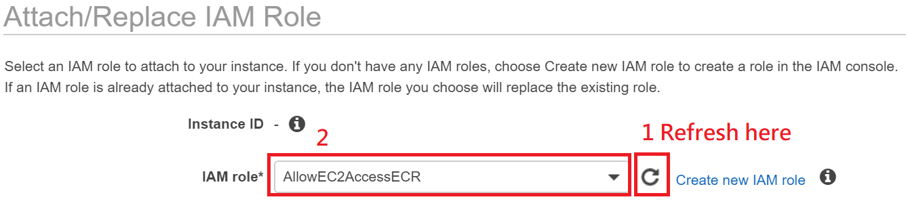

# Get Started with Docker & Amazon ECR

In this lab, you'll create a Docker image which provides a simple web application, and push your image to Amazon EC2 Container Registry ([Amazon ECR](https://aws.amazon.com/tw/ecr/)) which is a fully-managed Docker container registry.

## Prepare Cloud9 & CICD environment

>Make sure your are in US East (N. Virginia), which short name is us-east-1.

### Setup AWS Cloud9 environment
In this lab, we use AWS Cloud9 which is a cloud IDE intergrating programming languages and useful tools. A cloud9 environment is based on an EC2 instance. We can  develope applications with a browser anywhere.

* Sign in to the AWS Management Console, and then open [AWS Cloud9 console](https://console.aws.amazon.com/cloud9/).
* If prompted, type the email address for the AWS account root user, and then choose Next.
* If a welcome page is displayed, for **New AWS Cloud9 environment**, choose **Create environment**. Otherwise, choose **Create environment**.
* On the **Name environment**	page, for **Name**, type a name for your environment. Optionally add a description to your environment.
* Leave everything as default and click Next Step.
* Click **Create environment**. (It would  take 30~60 seconds to create your environment.)
* Because we want to accomplish access control by attaching a role ourself, we need to turn off the Cloud9 temporarily provided IAM credentials first.

* In [Amazon EC2 console](https://console.aws.amazon.com/ec2/v2/home?#Instances:sort=instanceId), right-click the EC2 instance named with "**aws-cloud9**" prefix and click **Instance Settings** -> **Attach/Replace IAM Role**.

* Click **Create new IAM role**.
* Click **Create role**.
* Click **EC2** then click **Next: Permissions**. Because Cloud9 is based on Amazon EC2, therefore we need to choose EC2.
* Search and select "**AmazonEC2ContainerRegistryFullAccess**" then Click **Next: Review**.
* For **Role Name** field, type "**AllowEC2AccessECR**" and click **Create Role**.
* Back to Attach/Replace IAM Role panel, click **Refresh** button, **select the role you just create** and click  **Apply**.

### Create a Docker Image
[Amazon ECS task definitions](https://docs.aws.amazon.com/AmazonECS/latest/developerguide/task_definitions.html) use Docker images to launch containers on the container instance in your clusters. In this section, we create a Docker image of a simple web application, and test it on your local system or EC2 instance, and then push the image to a container registry (such as Amazon ECR or Docker Hub) so that we can use it in an ECS task definition.

* In [AWS Cloud9 console](https://console.aws.amazon.com/cloud9/), click **Open IDE** buttom for the environent which you created.
* In Cloud9 environment, we can use terminal in the lower panel. 
* Verify that whether Docker is installed in Cloud9 environment with following command. In general, Cloud9 has installed Docker by default and therefore we don't need to install ourselves. 
	
	  docker version

  The output should be like as following:
  
  

* Use *vi* text editor to create and edit a file called "**_Dockerfile_**".  A *Dockerfile* is a manifest that describes the base image to use for your Docker image and what you want installed and running on it.

	  vi Dockerfile
    

* Press "**i**" key to enter insert mode and add the following content:

	FROM ubuntu:12.04

	# Install dependencies
      RUN apt-get update -y
      RUN apt-get install -y apache2

      # Install apache and write hellow world message
      RUN echo "Hello World!" > /var/www/index.html

      # Configure apache
      RUN a2enmod rewrite
      RUN chown -R www-data:www-data /var/www
      ENV APACHE_RUN_USER www-data
      ENV APACHE_RUN_GROUP www-data
      ENV APACHE_LOG_DIR /var/log/apache2

      EXPOSE 80

      CMD ["/usr/sbin/apache2", "-D",  "FOREGROUND"]
    
    
* Press "**ESC**" key to return to command mode.
* Type "**:wq!**" to save and exit.

	  :wq!

* Build the Docker image from your *Dockerfile*.
  >Note: the “hello-world” is your docker image name.

	  docker build -t hello-world .
    
* List docker images to verify whether the image was created correctly. You should be able to see there is a image called "**hello-world**".

	  docker image ls

*	Output:

    
 
* Run the newly built image. The *–p 80:80* option maps the exposed port 80 on the container to port 80 on the host system.

	  docker run -p 80:80 hello-world

  >Note: output from the Apache web server is displayed in the terminal window. You can ignore the ”Could not reliably determine the server's fully qualified domain name” message.

### Create a Repository for ECS

* In the **AWS Management Console**, on the **service** menu, click **EC2 Container Service**.

* Confirm you are in **N.Virginia** region.

* If a welcome page is displayed, click **Get started**, otherwise, click **Create repository**.

* Type Repository name: **docker-demo**

* Click **Next step**.

* You will see **Successfully created repository** message on the page.

### Tag your Image and Push it to Amazon ECR

* After creating an ECR repository, tag your image so you can push the image to this repository.

	  docker tag hello-world:latest 64691493xxxx.dkr.ecr.us-east-1.amazonaws.com/docker-demo:latest

	>Note: “hello-world” is the name of docker image, “64691493xxxx” is your AWS account ID and “docker-demo” is the repository you created in previous step.

	Run the following command to push this image to your newly created AWS repository:
		
      docker push 64691493xxxx.dkr.ecr.us-east-1.amazonaws.com/docker-demo:latest
    
	>Note: “docker-demo” is the repository you created in previous step.

	

### Create a task definition

* Back and continue to AWS ECS console.

* Click **Next Step**.

* Leave all the task definition setting as default, click **Next Step**.

* Leave all the configure service and network access as default, click **Next Step**.

* Confirm and leave the configure cluster and security group as default, click **Review & launch**.

* Click **Launch instance & run service**.

* Wait EC2 instance status – 0 of 13 complete.

### Exam your Resource

* In the **AWS Management Console**, on the **service** menu, click **EC2**.

* Click Instance, select **ECS Instance-EC2ContainerService-default** instance.

* On the **Description** tab in the lower pane, copy the **IPv4 Public IP** to your clipboard.

* Open a new browser tab, paste the IP address from your clipboard and hit Enter. The Container should appear.

* In the browser, you will see:

	*Hello World!*

## Conclusion

Congratulations! You now have learned how to:

* Setup a Docker engine.
* Create a container repository.
* Tag and push image to Amazon ECR.

