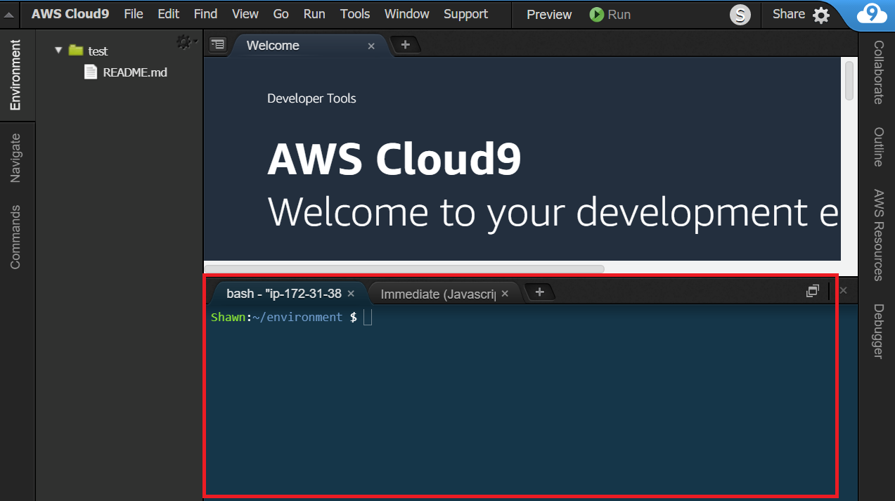
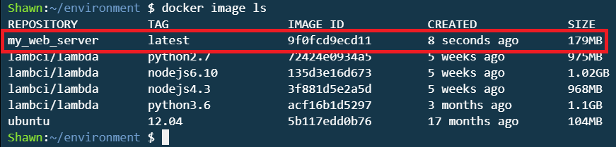
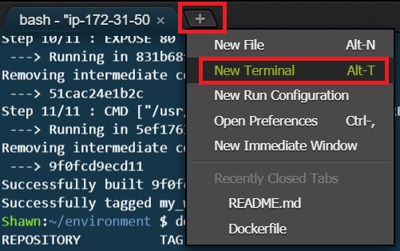
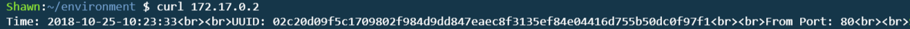
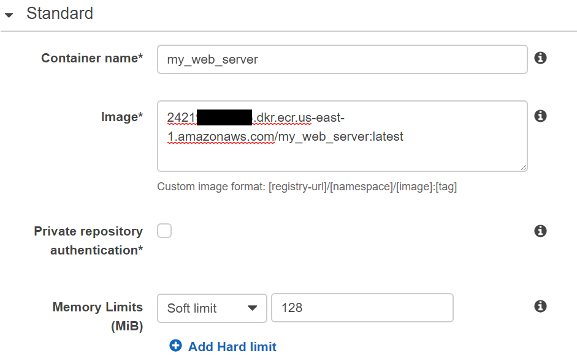
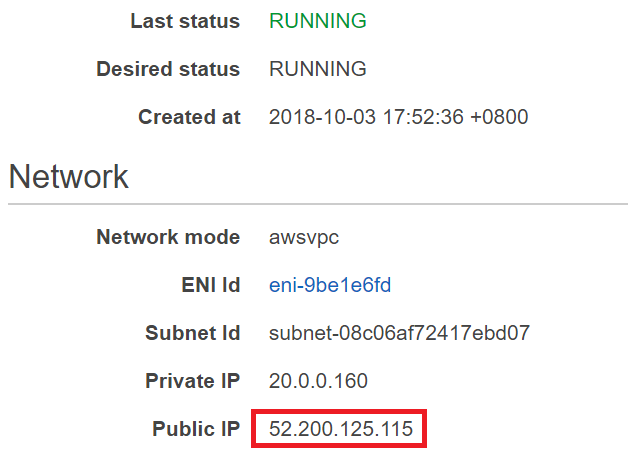
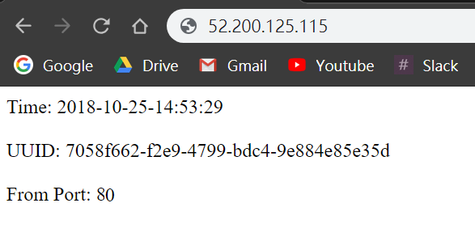
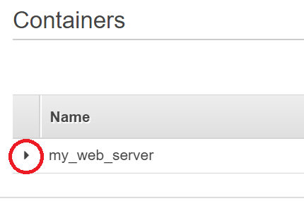
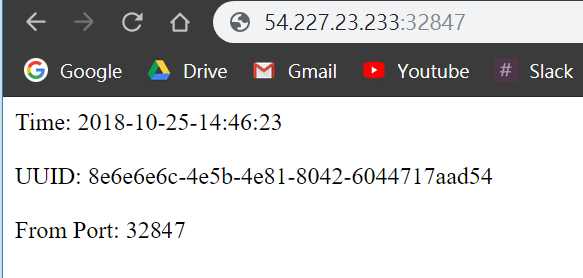

# Get Started with Docker & Amazon ECR

In this lab, we will create a Docker image which provides web service, push the image to Amazon Elastic Container Registry ([Amazon ECR](https://aws.amazon.com/tw/ecr/)) which is a fully-managed Docker container registry and run a container on Amazon Elastic Container Service([Amazon ECS](https://aws.amazon.com/tw/ecs)).  

## Prerequisite

>Make sure the region is US East (N. Virginia), which its short name is us-east-1.

## Set Up AWS Cloud9 Environment
In this lab, we use AWS Cloud9 which is a cloud IDE intergrating programming languages and useful tools. A cloud9 environment is based on an EC2 instance. We can  develope applications with a browser anywhere.

* Sign in to the AWS Management Console, and then open [AWS Cloud9 console](https://console.aws.amazon.com/cloud9/).

* If prompted, type the email address for the AWS account root user, and then choose Next.

* If a welcome page is displayed, for **New AWS Cloud9 environment**, choose **Create environment**. Otherwise, choose **Create environment**.

* On the **Name environment**	page, **type a name** for your environment. Optionally add a description to your environment.

* Leave everything as default and click **Next Step**.

* Click **Create environment**. It might take 30~60 seconds to create your environment.

* Because we want to accomplish access control by attaching a role ourself, we need to **turn off** the Cloud9 temporarily provided IAM credentials first.

* In [Amazon EC2 console](https://console.aws.amazon.com/ec2/v2/home?#Instances:sort=instanceId), right-click the EC2 instance named with **`aws-cloud9`** prefix and click **Instance Settings** -> **Attach/Replace IAM Role**.

* Click **Create new IAM role**.

* Click **Create role**.

* Click **EC2** then click **Next: Permissions**. Because Cloud9 is based on Amazon EC2, therefore we need to choose EC2.

* Search and select **AmazonEC2ContainerRegistryFullAccess** then Click **Next: Review**.

* In **Role Name** field, type **AllowEC2AccessECR** and click **Create Role**.

* Back to Attach/Replace IAM Role panel, click **Refresh** button, **select the role we just create** and click  **Apply**.

## Create a Docker Image
[Amazon ECS Task Definitions](https://docs.aws.amazon.com/AmazonECS/latest/developerguide/task_definitions.html) use Docker images to launch containers on the container instances in the cluster. In this section, we create a Docker image of a simple web application, and test it on local system or EC2 instance, and then push the image to a container registry (such as Amazon ECR or Docker Hub) so that we can use it in an ECS task definition.

* In [AWS Cloud9 console](https://console.aws.amazon.com/cloud9/), click **Open IDE** buttom for the environent which we created.
* In Cloud9 environment, we can use terminal in the lower panel. 
* Verify that whether Docker is installed in Cloud9 environment with following command. In general, Cloud9 has installed Docker by default and therefore we don't need to install ourself. 
	
	  docker version

  The output is supposed to be like as following:
  
  

* Use **_vi_** text editor to create and edit a file called **_Dockerfile_**.  A *Dockerfile* is a manifest that describes the base image to use for the Docker image and what we want installed and running on it.

	  vi Dockerfile
    

* Press **`i`** key to enter insert mode and add the following script. The script will be executed while building Docker image and Apache web server will be set up. 

      FROM ubuntu:12.04

      # Install dependencies
      RUN apt-get update -y
      RUN apt-get install -y apache2

      # Install apache and write hellow world message
      RUN echo "Hello World!" > /var/www/index.html

      # Configure apache
      RUN a2enmod rewrite
      RUN chown -R www-data:www-data /var/www
      ENV APACHE_RUN_USER www-data
      ENV APACHE_RUN_GROUP www-data
      ENV APACHE_LOG_DIR /var/log/apache2

      EXPOSE 80

      CMD ["/usr/sbin/apache2", "-D",  "FOREGROUND"]

* Press **`ESC`** key to return to command mode.

* Type **`:wq!`** to save and exit.

	  :wq!

* Build the Docker image from *Dockerfile*.
  >Note: "my_web_server" is the docker image name and "./" means the Dockerfile can be found in current directory.

	  docker build -t my_web_server ./
    
* List docker images to verify whether the image was created correctly. We should be able to see there is an image called **_my_web_server_**.

	  docker image ls

    
 
* Run the newly built image. The **`–p 80:80`** option maps the exposed port 80 on the container to port 80 on the host system.

	  docker run -p 80:80 my_web_server

  We should be able to see the following message with an **IP address** which is the web server's IP address.
  >Note: we can ignore the ”Could not reliably determine the server's fully qualified domain name” message from Apache web server.
  
  

* Open another terminal window by pressing **`alt + t`** key or clicking the **`+`** button and **`New Terminal`**.
  

* Use **_Curl_** to fetch the index page from the **IP address** displayed in previous one step. We should be able to see an **_Hello World!_** message displayed on the screen.

      curl [Server IP]

  

## Create a Repository for ECS

* In the **AWS Management Console**, on the **service** menu, click **Elastic Container Service**.

* Confirm that we are in **N.Virginia** region.

* Click **Repositories** on left panel.

* Click **Create Repository**.

* Type Repository name: **my_web_server**

* Click **Next step**.

* Click **Done** Once the repository has been created.

* The web page will automatically jump to the page of the repository. **Copy the Repository URI and paste to a text file** because we will use the URI later.

  

## Tag Image and Push to Amazon ECR
* Back to Cloud9 environment.

* After creating an ECR repository, type **`docker` `tag my_web_server:latest` `[Repository URI]:latest`** to tag the image so that we can push it to our repository later.

	  docker tag my_web_server:latest 2421xxxxxxxx.dkr.ecr.us-east-1.amazonaws.com/my_web_server:latest

	>Note: the first “my_web_server” is the name of docker image, "latest" is the tag which represents the image is the latest version, “2421xxxxxxxx” is the AWS account ID, "us-east-1" is the region and the second “my_web_server” is the repository we created in previous step.

* Before pushing the image to our remote repository on Amazon ECR, we need to login to Amazon ECR first. Type `aws ecr get-login --no-include-email --region us-east-1` to get the login command from AWS.

      aws ecr get-login --no-include-email --region us-east-1

* **Copy** the output command.

  

* **Paste** the command in terminal and **execute**, we should be able to see **_Login Succeeded_** message.

* After login, type **`docker` `push` `[Repository URI]:latest`** to push this image to our newly created repository on Amazon ECR:
		
      docker push 2421xxxxxxxx.dkr.ecr.us-east-1.amazonaws.com/my_web_server:latest
    
	>Note: “my_web_server” is the repository we created in previous step.

	

## Determine Using Amazon Fargates or EC2 instance
In Amazon ECS, we can easily launch containers without management of instances by using Amazon Fargate. We can also launch containers on Amazon EC2 instances and manage instances ourself.  

The rest of this tutorial is divided into two parts. For using Amazon Fargate, please step to **Use Amazon Fargate** part. For using Amazon EC2, please step to **Use Amazon EC2 Instance** part.

## Use Amazon Fargate

### Create Cluster
* In the **AWS Management Console**, on the **service** menu, click **Elastic Container Service**.

* On the left panel, click **Clusters**.

* Click **Create Cluster**.

* Click **Networking only** and Click **Next step**.

* In **Cluster Name**, Type **FargateCluster**.

* In **Networking** part, it's optional to create a new VPC for the cluster. In this tutorial, we create a new VPC here hence we **click the checkbox of create VPC**.

* In **CIDR Block**, type **20.0.0.0/16**.

* In **Subnet 1**, type **20.0.0.0/24**.

* In **Subnet 2**, type **20.0.1.0/24**.

* Click **create** and wait for the creation.

### Create Task Definition for Amazon ECS

* Back to [Amazon ECS console](https://console.aws.amazon.com/ecs/home), click **Task Definitions** on left panel.

* Click **Create new Task Definition**.

* Select **Fargate** type and click **Next Step**.

* In **Task Definition Name**, type **runWebServerWithFargate**.

* Step to Task Size part, In **Task Memory (GB)**, select **0.5GB**.

* In **Task CPU (vCPU)**, select **0.25 vCPU**.

* In **Container Definetions** part,  click **Add container** button to add a container. In Amazon ECS, we can define several containers for a task. In this tutorial, we only define one container which will serve as a web server. 

* In **Container name**, type **my_web_server**.

* In **Image**, type **`[Repository URI]:latest`**.

      2421xxxxxxxx.dkr.ecr.us-east-1.amazonaws.com/my_web_server:latest

* In **Memory Limits (MB)**, Select **Soft limit** and type **128**.

  

* In **Port mappings**, type **80** and select **tcp**.

* Click **Add**.

* Click **Create** and wait for the creation of Task Definition.

### Create Service on Amazon ECS
After creating task definition, we can start a task standalone or start several tasks simultaneously by creating a service. In this tutorial, we will create a service. 

* Back to [Amazon ECS console](https://console.aws.amazon.com/ecs/home), click **Clusters** on left panel.

* Click **FargateCluster**.

* In **Services** tab, click **Create**.

* In **Launch type**, select **FARGATE**.

* In **Task Definition**, select **runWebServerUsingFargate**.

* In **Service name**, type **myWebServerUsingFargate**.

* In **Number of tasks**, type **1**. If you want to create a service which starts several tasks simultaneously, you can type the number of tasks you need here. In this tutorial, we only need a task hence we type 1 here.

* Click **Next step**.

* In **Cluster VPC**, select **the VPC with CIDR 20.0.0.0/16**.

* In **Subnet**, add **both subnet**.

* In **Auto-assign public IP**, select **ENABLE**.

* Leave the rest of setting as default and click **Next step**.

* Click **Next step**.

* Click **Create Service** and wait for creation.

* Click **View Service**.

* In Service page, click **Tasks** tab below and we can see there is a tasks.

* Click **the task** in task list, refresh the page until the **Last status** is **RUNNING** rather than **PENDING**.

* Copy the **public IP**.

  

* Open a new browser tab, paste the IP address and press Enter. In the browser, we should be able to see an **_Hello World!_** message.

  
	

## Use Amazon EC2 Instance

### Create Cluster
* In the **AWS Management Console**, on the **service** menu, click **Elastic Container Service**.

* On the left panel, click **Clusters**.

* Click **Create Cluster**.

* Click **EC2 Linux + Networking** and click **Next step**.

* In **Cluster Name**, type **EC2Cluster**.

* In Instance Configuration part, in **EC2 instance type**, select **t2.micro**.

* In **Number of instances**, type **1**.

* In Networking part, select **Create a new VPC**.

* In **CIDR Block**, type **30.0.0.0/16**.

* In **Subnet 1**, type **30.0.0.0/24**.

* In **Subnet 2**, type **30.0.1.0/24**.

* Leave other settings as default, click **create** and wait for the creation.

### Create a Task Definition for Amazon ECS

* Back to [Amazon ECS console](https://console.aws.amazon.com/ecs/home), click **Task Definitions** on left panel.

* Click **Create new Task Definition**.

* Select **EC2** type and click **Next Step**.

* In **Task Definition Name**, type **runWebServerWithEC2**.

* In **Network Mode**, select **\<default\>**.

* Step to Task Size part, In **Task Memory (MiB)**, type **512**.

* In **Task CPU (unit)**, type **0.25 vCPU**.

* In **Container Definetions** part,  click **Add container** button to add a container. In Amazon ECS, we can define several containers for a task. In this tutorial, we only define one container which will serve as a web server. 

* In **Container name**, type **my_web_server**.

* In **Image**, type **`[Repository URI]:latest`**.

      2421xxxxxxxx.dkr.ecr.us-east-1.amazonaws.com/my_web_server:latest

* In **Memory Limits (MB)**, Select **Soft limit** and type **128**.

  

* In **Port mappings**, type **80** for Host port, type **80** for Container port and select **tcp**.

* Click **Add**.

* Click **Create** and wait for the creation of Task Definition.

### Create Service on Amazon ECS
After creating task definition, we can start a task standalone or start several tasks simultaneously by creating a service. In this tutorial, we will create a service. 

* Back to [Amazon ECS console](https://console.aws.amazon.com/ecs/home), click **Clusters** on left panel.

* Click **EC2Cluster**.

* In **Services** tab, click **Create**.

* In **Launch type**, select **EC2**.

* In **Task Definition**, select **runWebServerWithEC2**.

* In **Service name**, type **myWebServerUsingEC2**.

* In **Service type**, select **REPLICA**.

* In **Number of tasks**, type **1**. If you want to create a service which starts several tasks simultaneously, you can type the number of tasks you need here. In this tutorial, we only need a task hence we type 1 here.

* Click **Next step**.

* Click **Next step**.

* Click **Next step**.

* Click **Create Service** and wait for the creation.

* Click **View Service**.

* In Service page, click **Tasks** tab below and we can see there is a tasks.

* Click **the task** in task list, refresh the page until the **Last status** is **RUNNING** rather than **PENDING**.

* In **Containers** part, click **the triangle arrow** below to expand the table.

  

* Copy the **External Link** in **Network bindings** part.

  

* Open a new browser tab, paste the external link and press Enter. In the browser, we should be able to see an **_Hello World!_** message.

  

## Conclusion

Congratulations! We now have learned how to:

* Setup a Docker engine.
* Create a container repository.
* Tag and push image to Amazon ECR.
* Run image on Amazon ECS.
